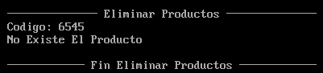

*Universidad de San Carlos de Guatemala*  
*Facultad de Ingenieria*  
*Escuela de Ciencias y Sistemas*  
*Arquitectura de Computadores y Ensambladores 1, 2023.*  
___
## **PROYECTO 1**
___
**201908355 - Danny Hugo Bryan Tejaxún Pichiyá**
___
# Manual De Usuario

## Ventanas Principales
### Archivo De Configuración

### Encabezado

### Menú Principal
Para navegar entre las diferentes opciones del menú es necesario presionar el número de la opción a la que se desea ingresar.  

### Menú Productos
Para navegar entre las diferentes opciones del menú es necesario presionar el número de la opción a la que se desea ingresar.  

* #### Ingresar Producto
Los nuevos productos deberán ser ingresados con los siguientes campos:  

* #### Ver Productos
Los productos guardados se podrán visualizar en grupos de 5 productos para un mejor manejo. Para seguir avanzando se requiere presionar la tecla *enter* o para salir de la visualización presionar la tecla *q*.  

* #### Eliminar Producto
Los prouctos guardados podrán ser eliminados. Al ingresar el código de producto se verificará que tenga el formato correcto y que el código pertenezca a alguno de los productos registrados en el sistema.
  

### Menú Ventas
Para navegar entre las diferentes opciones del menú es necesario presionar el número de la opción a la que se desea ingresar.  

### Menú Herramientas
Para navegar entre las diferentes opciones del menú es necesario presionar el número de la opción a la que se desea ingresar.  

### Validación De Campos


___
# Manual Técnico
## Macros Principales
### Parseo De Archivo De Configuración
Su función es hacer un análisis léxico del contenido del archivo de configuración que contiene las credenciales del usuario para iniciar la sesión correctamente.
```js
parseConf macro
    local loginFallido, loginExitoso, evaluarLxL, evaluarLinea, retornoCarro, verificarEstado, verificarTagCredenciales, credsEncontrado, verificarTagUsuarioOClave, usuarioEncontrado, espacios1, espacios2, guardarUsuario, cicloGuardarUsuario, claveEncontrado, espacios3, espacios4, guardarClave, cicloGuardarClave, terminate
        ; ABRIR ARCHIVO DE CONFIGURACION
        abrirArchivo f_conf
        jc loginFallido
        mov [h_conf], AX
    evaluarLxL:
        mov DI, offset buffer_linea
        mov AL, 00                ; ASIGNACION DE ESTADO INICIAL AUTOMATA
        mov [longitud_linea_leida], AL
    evaluarLinea:
        mov BX, [h_conf]
        mov AH, 3f
        mov CX, 01                ; CX = CANTIDAD DE BYTES A LEER
        mov DX, DI
        int 21
        cmp CX, 00                ; CX = BYTES LEIDOS
        je verificarEstado        ; SALTA AL FINAL SI LEYÓ CERO BYTES
        ; VALIDACIÓN CARACTER LEIDO
        mov AL, [DI]              ; AL = CARACTER LEIDO
        cmp AL, 0d                ; COMPARA AL CON RETORNO DE CARRO
        je retornoCarro           ; SALTA SI AL = 0D
        cmp AL, 0a                ; COMPARA AL CON SALTO DE LINEA
        je verificarEstado        ; SALTA SI AL = 0A
        ; INCREMENTAR LA LONGITUD DE LA LÍNEA LEIDA
        mov AL, [longitud_linea_leida]
        inc AL
        mov [longitud_linea_leida], AL
        inc DI
        jmp evaluarLinea
    retornoCarro:
        inc DI
        jmp evaluarLinea
    verificarEstado:
        mov AL, 00                   ; AL = ESTADO 0
        cmp AL, [estado]             ; COMPARA AL CON ESTADO ACTUAL DEL AUTOMATA
        je verificarTagCredenciales  ; SALTA PARA VERIFICAR SI SE ENCONTRÓ [CREDENCIALES]
        mov AL, 01                   ; AL = ESTADO 1
        cmp AL, [estado]             ; COMPARA AL CON ESTADO ACTUAL DEL AUTOMATA
        je verificarTagUsuarioOClave ; SALTA PARA VERIFICAR SI SE ENCONTRÓ CLAVE O USUARIO
        mov AL, 02                   ; AL = ESTADO 2
        cmp AL, [estado]             ; COMPARA AL CON ESTADO ACTUAL DEL AUTOMATA
        je verificarTagUsuarioOClave ; SALTA PARA VERIFICAR SI SE ENCONTRÓ CLAVE O USUARIO
        jmp loginExitoso             ; SALTA PARA VALIDAR LAS CREDENCIALES CAPTURADAS
    verificarTagCredenciales:
        mov CH, 00
        mov CL, [TOK_cred]
        strcmp buffer_linea, TOK_cred, 0e  ; COMPARACION DE CADENAS: RESULTADO EN AL
        cmp AL, 0ff
        je credsEncontrado
        mov DI, offset buffer_linea
        jmp loginFallido
    credsEncontrado:
        ; INCREMENTAR EL NÚMERO DE ESTADO DEL AUTÓMATA
        mov AL, [estado]
        inc AL
        mov [estado], AL
        mov DI, offset buffer_linea
        jmp evaluarLinea
    verificarTagUsuarioOClave:
        ; VALIDACIÓN PARA PALABRA RESERVADA USUARIO
        mov CH, 00
        mov CL, [TOK_usuario]
        strcmp buffer_linea, TOK_usuario, 07  ; COMPARACION DE CADENAS: RESULTADO EN AL
        cmp AL, 0ff
        je usuarioEncontrado
        ; VALIDACIÓN PARA PALABRA RESERVADA CLAVE
        mov CH, 00
        mov CL, [TOK_clave]
        strcmp buffer_linea, TOK_clave, 05  ; COMPARACION DE CADENAS: RESULTADO EN AL
        cmp AL, 0ff
        je claveEncontrado
        mov DI, offset buffer_linea
        jmp loginFallido
    usuarioEncontrado:
    espacios1:
        mov AL, [SI]
        inc SI
        cmp AL, 20
        je espacios1
        cmp AL, 3d
        je espacios2
        mov DI, offset buffer_linea
        jmp loginFallido
    espacios2:
        mov AL, [SI]
        inc SI
        cmp AL, 20
        je espacios2
        cmp AL, 22
        je guardarUsuario
        mov DI, offset buffer_linea
        jmp loginFallido
    guardarUsuario:
        mov DI, offset usuario_c
    cicloGuardarUsuario:
        mov AL, [SI]
        mov [DI], AL
        inc SI
        inc DI
        cmp AL, 22
        jne cicloGuardarUsuario
        ; INCREMENTAR EL NÚMERO DE ESTADO DEL AUTÓMATA
        mov AL, [estado]
        inc AL
        mov [estado], AL
        mov DI, offset buffer_linea
        jmp evaluarLinea
    claveEncontrado:
    espacios3:
        mov AL, [SI]
        inc SI
        cmp AL, 20
        je espacios3
        cmp AL, 3d
        je espacios4
        mov DI, offset buffer_linea
        jmp loginFallido
    espacios4:
        mov AL, [SI]
        inc SI
        cmp AL, 20
        je espacios4
        cmp AL, 22
        je guardarClave
        mov DI, offset buffer_linea
        jmp loginFallido
    guardarClave:
        mov DI, offset clave_c
    cicloGuardarClave:
        mov AL, [SI]
        mov [DI], AL
        inc SI
        inc DI
        cmp AL, 22
        jne cicloGuardarClave
        ; INCREMENTAR EL NÚMERO DE ESTADO DEL AUTÓMATA
        mov AL, [estado]
        inc AL
        mov [estado], AL
        mov DI, offset buffer_linea
        jmp evaluarLinea
    loginFallido:
		mov AL, 00
        jmp terminate
    loginExitoso:
		mov AL, 0ff
    terminate:
endm
```
### Leer Caracter
Su función es detectar cuando se presiona una tecla y guarda el código ASCII de la tecla en AL.
```js
; --- LEER CARACTER
leerCaracter macro
	mov AH, 08
	int 21
endm
```
### Leer Entrada
Lee una entrada por teclado y lo almacena en el buffer que se le indique.
```js
; --- LEER ENTRADA POR TECLADO
leerEntrada macro buffer
	mov DX, offset buffer
	mov AH, 0a
	int 21
endm
```
### Longitud Cadena
Determina la longitud de una cadena de caracteres y almacena la longitud en AL.
```js
; --- LONGITUD CADENA
lenCadena macro buffer
	mov DI, offset buffer
	inc DI
	mov AL, [DI]
endm
```
### Guardar Campos De Producto
Guarda lo almacenado en el buffer de entrada en una etiqueta destinada para ese fin específico.
```js
; --- ACEPTAR CAMPO Y GUARDAR EN ESTRUCTURA
memcpy macro campo, buffer
	local aceptarCampo, copiarCampoAEstructura
	aceptarCampo:
		mov SI, offset campo
		mov DI, offset buffer
		inc DI
		mov CH, 00
		mov CL, [DI]
		inc DI                   ; CONTENIDO EN EL BUFFER
	copiarCampoAEstructura:
		mov AL, [DI]
		mov [SI], AL
		inc SI
		inc DI
		loop copiarCampoAEstructura
endm
```
### Abrir Archivo M
Intenta abrir el archivo, en caso de que no exista lo crea y posteriormente lo abre, de lo contrario lo abre directamente.
```js
abrirArchivoM macro archivo
	local crearArchivo, terminate
		; INTENTAR ABRIR EL ARCHIVO NORMALMENTE
		mov AL, 02
		mov AH, 3d
		mov DX, offset archivo
		int 21
		; SI NO EXISTE LO CREAMOS
		jc crearArchivo
		; SI EXISTE SALIMOS
		jmp terminate
	crearArchivo:
		mov CX, 0000
		mov DX, offset archivo
		mov AH, 3c
		int 21
		; ARCHIVO ABIERTO
	terminate:
endm
```
### Abrir Archivo
Intenta abrir el archivo, y lo abre si existe.
```js
abrirArchivo macro archivo
	mov AL, 02
	mov AH, 3d
	mov DX, offset archivo
	int 21
endm
```
### Escribir Producto Al Final Del Archivo
Posiciona el puntero del archivo en el final y escribe el producto que fue ingresado previamente.
```js
escribirAlFinalArchivoProducto macro handle, campo, numeros
	mov [handle], AX            ; GUARDAR HANDLE
	mov BX, [handle]            ; OBTENER HANDLE
	; IR AL FINAL DEL ARCHIVO
	mov CX, 00
	mov DX, 00
	mov AL, 02
	mov AH, 42
	int 21
	; ESCRIBIR EN EL ARCHIVO
	mov CX, 26
	mov DX, offset campo
	mov AH, 40
	int 21
	; ESCRIBIR EN EL ARCHIVO LOS DATOS NUMÉRICOS
	mov CX, 04
	mov DX, offset numeros
	mov AH, 40
	int 21
endm
```
### Cerrar Archivo
Cierra el archivo abierto previamente.
```js
cerrarArchivo macro
	mov AH, 3e
	int 21
endm
```
### Parsear Cadena A Número
Convierte una cadena numérica a un número, usando la lógica del sistema de numeración posicional decimal (base 10).
```js
stoi macro numero, cadena
	local convertir, terminate
		mov DI, offset cadena
		mov AX, 0000              ; INICIALIZAR LA SALIDA
		mov CX, 0005
	convertir:
		mov BL, [DI]
		cmp BL, 00
		je terminate
		sub BL, 30                ; BL VALOR NUMÉRICO DEL CARACTER
		mov DX, 000a              ; DX VALOR 10 (000A)
		mul DX                    ; AX * DX : SIEMPRE MUL MULTIPLICA EL OPERANDO POR AX
		mov BH, 00
		add AX, BX                ; AX += BX
		inc DI                    ; AVANZA PUNTERO EN LA CADENA
		loop convertir
	terminate:
		mov [numero], AX
endm
```
### Parsear Número A Cadena
Convierte un número a una cadena de caracteres. Utiliza el sistema de numeración posicional decimal para convertir dígito por dígito a una cadena.
```js
toString macro cadena, numero
	local ciclo, cicloConvertir, aumentos, aumentarSiguiente, terminate
		mov AX, [numero]
		mov CX, 0005              ; INICIALIZAR CONTADOR
		mov DI, offset cadena
	ciclo:
		mov BL, 30 
		mov [DI], BL
		inc DI
		loop ciclo
		; TENEMOS '0' EN TODA LA CADENA
		mov CX, AX                ; INICIALIZAR CONTADOR
		mov DI, offset cadena
		add DI, 0004
		;
	cicloConvertir:
		mov BL, [DI]
		inc BL
		mov [DI], BL
		cmp BL, 3a
		je aumentos
		loop cicloConvertir
		jmp terminate
	aumentos:
		push DI
	aumentarSiguiente:
		mov BL, 30                ; PONER EN '0' EL ACTUAL
		mov [DI], BL
		dec DI
		mov BL, [DI]
		inc BL
		mov [DI], BL
		cmp BL, 3a
		je aumentarSiguiente
		pop DI
		loop cicloConvertir
	terminate:
endm
```
### Obtener Campo Producto
Obtiene un campo leido de un archivo, en este caso se utilizó exclusivamente para los campos de los productos.
```js
obtenerCampo macro campo
	local ciclo, ponerDolar
		mov DI, offset campo
	ciclo:
		mov AL, [DI]
		cmp AL, 00
		je ponerDolar
		inc DI
		jmp ciclo
	ponerDolar:
		mov AL, 24 ;; DÓLAR
		mov [DI], AL
endm
```
### Imprimir Producto
Imprime los campos necesarios obtenidos de un producto. Se usaron macros previamente creados de forma conjunta.
```js
imprimirProducto macro codigo, descripcion
	obtenerCampo codigo
	print codigo
	print guion
	obtenerCampo descripcion
	println descripcion
endm
```
### Memset
Limpia la memoria de determinada etiqueta o campo con una longitud específica.
```js
memset macro campo, longitud
	local ciclo, terminate
		mov DI, offset campo
		mov CX, longitud
	ciclo:
		mov AL, 00
		mov [DI], AL
		inc DI
		loop ciclo
endm
```
### Comparación De Cadenas
Compara dos cadenas y almacena el resultado (falso = 00 ó verdadero = 0ff) en DL.
```js
strcmp macro cadena1, cadena2, tam
	local ciclo, diferentes, terminate
		mov SI, offset cadena1
		mov DI, offset cadena2
		mov CX, tam
	ciclo:
		mov AL, [SI]
		cmp [DI], AL
		jne diferentes
		inc DI
		inc SI
		loop ciclo
		mov AL, 0ff
		jmp terminate
	diferentes:
		mov AL, 00
	terminate:
endm
```
### Verificación De Existencia De Un Producto
Realiza la búsqueda del producto mediante su código de identificación.
```js
existeProducto macro codigo
	local buscarProducto, respuestaV, respuestaF, terminate
		abrirArchivo f_productos
		jc respuestaF
		mov [h_productos], AX
	buscarProducto:
		mov BX, [h_productos]
		mov CX, 02a
		mov DX, offset p_codigo_temp2
		mov AH, 3f
		int 21
		;
		cmp AX, 00
		je respuestaF    ; SI AX = 0 SALTA
		; VALIDA SI EL PRODUCTO ES VÁLIDO
		mov AL, 0000
		cmp [codigo], AL
		je buscarProducto
		; VALIDA QUE EL CÓDIGO INGRESADO COINCIDA CON ALGUNO GUARDADO
		strcmp p_codigo_temp2, codigo, 05 ; VALIDA COINCIDENCIA DE CADENAS, GUARDA RESULTADO EN DL
		; AL = 0FF : VERDADERO ; DL = 00 : FALSO
		cmp AL, 0ff           ; COMPARA AL
		je respuestaV
		jmp buscarProducto
	respuestaV:
		mov AL, 0ff
		jmp terminate
	respuestaF:
		mov AL, 00
	terminate:
endm
```
### Validación De Dígito
Valida con respecto al código ASCII del caracter enviado en la macro. Si se encuentra fuera del rango aceptado mueve 00 (falso) a DL y 0ff (verdadero) a DL si se encuentra en el rango.
```js
isDigit macro caracter
	local terminateV, terminateF, terminate
		cmp caracter, 30          ; COMPARA LA POSICION CON ASCII HEX DE 0 = 30
		jb terminateF             ; SALTA A FALSO SI EL CARACTER EVALUADO ESTÁ ANTES DE 0 EN ASCII
		cmp caracter, 39          ; COMPARA LA POSICION CON ASCII HEX DE 9 = 39
		ja terminateF             ; SALTA A FALSO SI EL CARACTER EVALUADO ESTÁ DESPUÉS DE 9 EN ASCII
	terminateV:
		mov DL, 0ff               ; ASIGNA DL = 0FF PARA VALIDACIÓN VERDADERA
		jmp terminate             ; SALTA A TERMINAR
	terminateF:
		mov DL, 00                ; ASIGNA DL = 00 PARA VALIDACIÓN FALSA
	terminate:
endm
```
### Validación De Letra Mayúscula
Valida con respecto al código ASCII del caracter enviado en la macro. Si se encuentra fuera del rango aceptado mueve 00 (falso) a DL y 0ff (verdadero) a DL si se encuentra en el rango.
```js
isAlphaU macro caracter
	local terminateV, terminateF, terminate
		cmp caracter, 41          ; COMPARA LA POSICION CON ASCII HEX DE A = 41
		jb terminateF             ; SALTA A FALSO SI EL CARACTER EVALUADO ESTÁ ANTES DE A EN ASCII
		cmp caracter, 05a         ; COMPARA LA POSICION CON ASCII HEX DE Z = 5A
		ja terminateF             ; SALTA A FALSO SI EL CARACTER EVALUADO ESTÁ DESPUÉS DE Z EN ASCII
	terminateV:
		mov DL, 0ff               ; ASIGNA DL = 0FF PARA VALIDACIÓN VERDADERA
		jmp terminate             ; SALTA A TERMINAR
	terminateF:
		mov DL, 00                ; ASIGNA DL = 00 PARA VALIDACIÓN FALSA
	terminate:
endm
```
### Validación De Letra Minúscula
Valida con respecto al código ASCII del caracter enviado en la macro. Si se encuentra fuera del rango aceptado mueve 00 (falso) a DL y 0ff (verdadero) a DL si se encuentra en el rango.
```js
isAlphaL macro caracter
	local terminateV, terminateF, terminate
		cmp caracter, 61          ; COMPARA LA POSICION CON ASCII HEX DE a = 61
		jb terminateF             ; SALTA A FALSO SI EL CARACTER EVALUADO ESTÁ ANTES DE A EN ASCII
		cmp caracter, 07a         ; COMPARA LA POSICION CON ASCII HEX DE z = 7A
		ja terminateF             ; SALTA A FALSO SI EL CARACTER EVALUADO ESTÁ DESPUÉS DE Z EN ASCII
	terminateV:
		mov DL, 0ff               ; ASIGNA DL = 0FF PARA VALIDACIÓN VERDADERA
		jmp terminate             ; SALTA A TERMINAR
	terminateF:
		mov DL, 00                ; ASIGNA DL = 00 PARA VALIDACIÓN FALSA
	terminate:
endm
```
### Validación De Código Con Expresion Regular
```js
esCodigoValido macro campo
	local calcular, evaluar, continuar, terminateV, terminateF, terminate
		; CALCULO DE LONGITUD DE CARACTERES
		mov DI, offset campo
		mov CX, 00
	calcular:
		mov AL, [DI]
		inc DI
		inc CX
		cmp AL, 00
		jne calcular              ; FIN CALCULAR LONGITUD
		dec CX
		; POSICIONAR AL INICIO DEL CAMPO
		mov DI, offset campo
	evaluar:
		mov AL, [DI]              ; 
		mov [caracter], AL        ; CARACTER = AL
		isDigit caracter          ; VALIDAR CARACTER COMO DÍGITO, RESULTADO EN DL
		cmp DL, 0ff               ; COMPARA DL CON 0FF
		je continuar              ; SALTA A CONTINUAR SI EL CARACTER ES DIGÍTO
		isAlphaU AL               ; VALIDAR CARACTER COMO LETRA MAYÚSCULA, RESULTADO EN DL
		cmp DL, 0ff               ; COMPARA DL CON 0FF
		je continuar              ; SALTA A CONTINUAR SI EL CARACTER ES LETRA MAYÚSCULA
		jmp terminateF            ; SALTA A FALSO SI EL CARACTER NO CUMPLE CON LAS VALIDACIONES ANTERIORES
	continuar:
		inc DI                    ; INCREMENTA POSICION
		loop evaluar              ; REPITE CICLO
	terminateV:
		mov AL, 0ff               ; ASIGNA AL = 0FF PARA VALIDACIÓN VERDADERA
		jmp terminate             ; SALTA A TERMINAR
	terminateF:
		mov AL, 00                ; ASIGNA AL = 00 PARA VALIDACIÓN FALSA
	terminate:
endm
```
### Validación De Descripción Con Expresion Regular
```js
esDescripcionValida macro campo
	local calcular, evaluar, continuar, terminateV, terminateF, terminate
		; CALCULO DE LONGITUD DE CARACTERES
		mov DI, offset campo
		mov CX, 00
	calcular:
		mov AL, [DI]
		inc DI
		inc CX
		cmp AL, 00
		jne calcular              ; FIN CALCULAR LONGITUD
		dec CX
		; POSICIONAR AL INICIO DEL CAMPO
		mov DI, offset campo
	evaluar:
		mov AL, [DI]              ; 
		mov [caracter], AL        ; CARACTER = AL
		isDigit caracter          ; VALIDAR CARACTER COMO DÍGITO, RESULTADO EN DL
		cmp DL, 0ff               ; COMPARA DL CON 0FF
		je continuar              ; SALTA A CONTINUAR SI EL CARACTER ES DIGÍTO
		isAlphaU AL               ; VALIDAR CARACTER COMO LETRA MAYÚSCULA, RESULTADO EN DL
		cmp DL, 0ff               ; COMPARA DL CON 0FF
		je continuar              ; SALTA A CONTINUAR SI EL CARACTER ES LETRA MAYÚSCULA
		isAlphaL AL               ; VALIDAR CARACTER COMO LETRA MINÚSCULA, RESULTADO EN DL
		cmp DL, 0ff               ; COMPARA DL CON 0FF
		je continuar              ; SALTA A CONTINUAR SI EL CARACTER ES LETRA MINÚSCULA
		cmp AL, 20                ; COMPARA AL (CARACTER) CON ESPACIO EN ASCII
		je continuar              ; SALTA A CONTINUAR SI EL CARACTER ES ESPACIO
		cmp AL, 21                ; COMPARA AL (CARACTER) CON EXCLAMACIÓN CERRADA EN ASCII
		je continuar              ; SALTA A CONTINUAR SI EL CARACTER ES EXCLAMACIÓN CERRADA
		cmp AL, 02c               ; COMPARA AL (CARACTER) CON COMA EN ASCII
		je continuar              ; SALTA A CONTINUAR SI EL CARACTER ES COMA
		cmp AL, 02e               ; COMPARA AL (CARACTER) CON PUNTO EN ASCII
		je continuar              ; SALTA A CONTINUAR SI EL CARACTER ES PUNTO
		jmp terminateF            ; SALTA A FALSO SI EL CARACTER NO CUMPLE CON LAS VALIDACIONES ANTERIORES
	continuar:
		inc DI                    ; INCREMENTA POSICION
		loop evaluar              ; REPITE CICLO
	terminateV:
		mov AL, 0ff               ; ASIGNA AL = 0FF PARA VALIDACIÓN VERDADERA
		jmp terminate             ; SALTA A TERMINAR
	terminateF:
		mov AL, 00                ; ASIGNA AL = 00 PARA VALIDACIÓN FALSA
	terminate:
endm
```
### Validación De Número Con Expresion Regular
```js
esNumeroValido macro campo
	local calcular, evaluar, continuar, terminateV, terminateF, terminate
		; CALCULO DE LONGITUD DE CARACTERES
		mov DI, offset campo
		mov CX, 00
	calcular:
		mov AL, [DI]
		inc DI
		inc CX
		cmp AL, 00
		jne calcular              ; FIN CALCULAR LONGITUD
		dec CX
		; POSICIONAR AL INICIO DEL CAMPO
		mov DI, offset campo
	evaluar:
		mov AL, [DI]              ; 
		mov [caracter], AL        ; CARACTER = AL
		isDigit caracter          ; VALIDAR CARACTER COMO DÍGITO, RESULTADO EN DL
		cmp DL, 0ff               ; COMPARA DL CON 0FF
		je continuar              ; SALTA A CONTINUAR SI EL CARACTER ES DIGÍTO
		jmp terminateF            ; SALTA A FALSO SI EL CARACTER NO CUMPLE CON LAS VALIDACIONES ANTERIORES
	continuar:
		inc DI                    ; INCREMENTA POSICION
		loop evaluar              ; REPITE CICLO
	terminateV:
		mov AL, 0ff               ; ASIGNA AL = 0FF PARA VALIDACIÓN VERDADERA
		jmp terminate             ; SALTA A TERMINAR
	terminateF:
		mov AL, 00                ; ASIGNA AL = 00 PARA VALIDACIÓN FALSA
	terminate:
endm
```